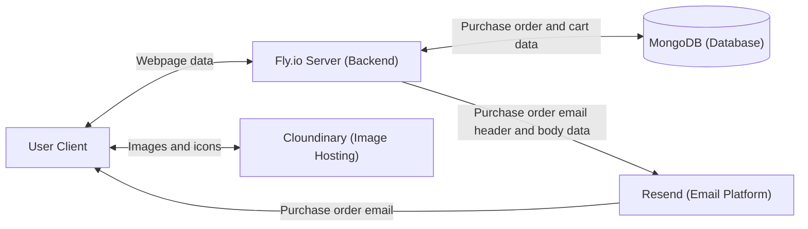
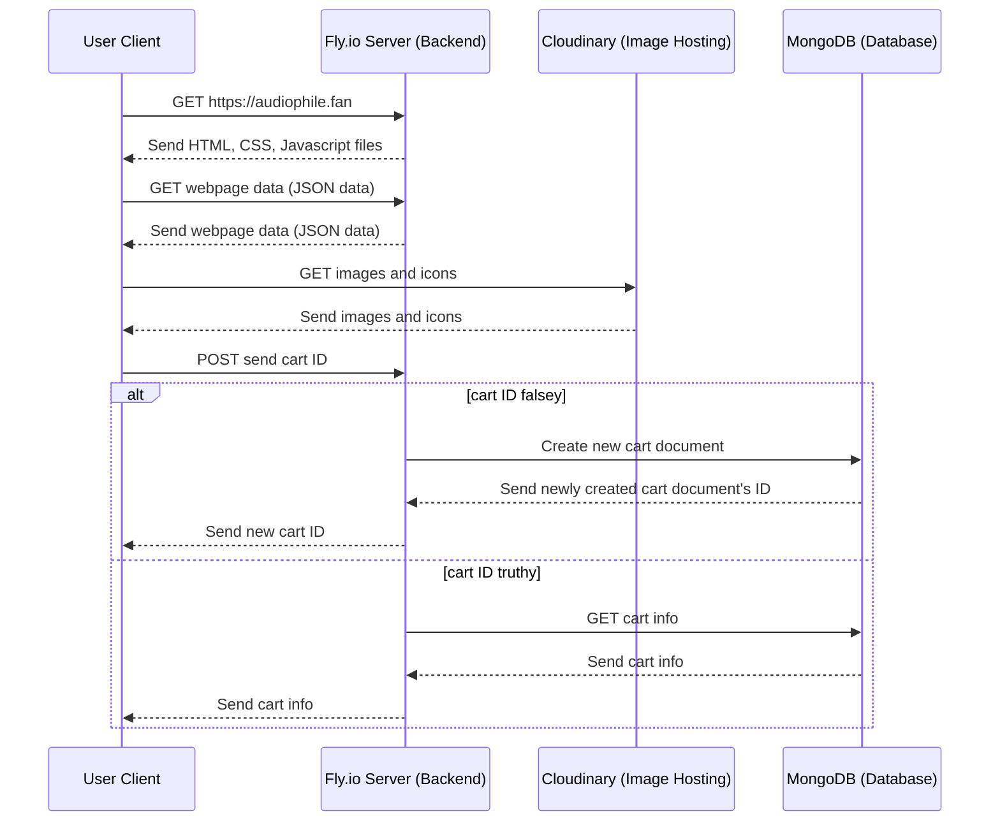
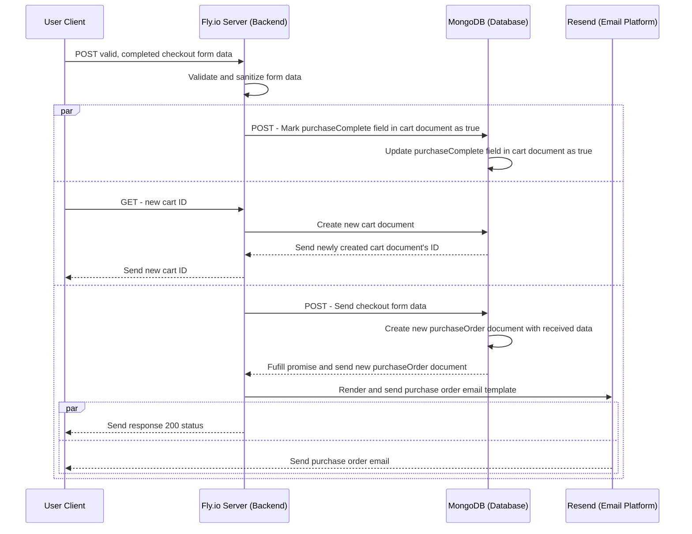
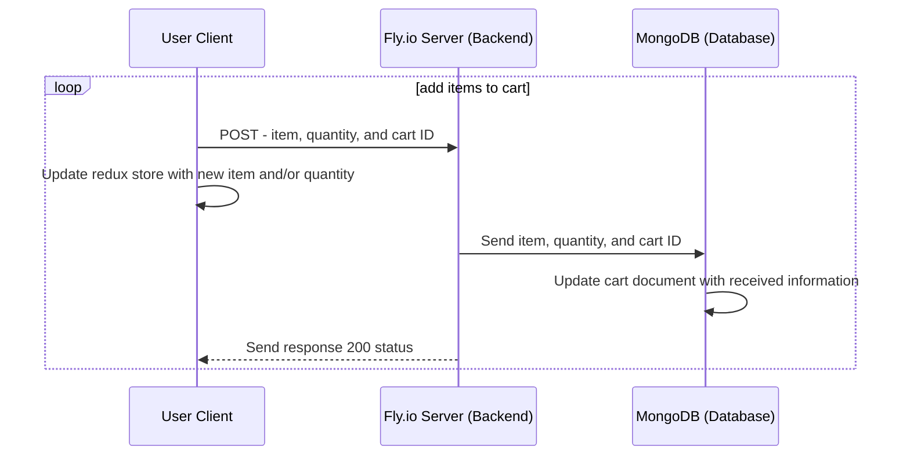

<a name="readme-top"></a>

<!-- PROJECT LOGO -->
<br />
<div align="center">
  <a href="https://github.com/github_username/repo_name">
    
  </a>

<h3 align="center">audiophile</h3>
  <p align="center">
    A static E-Commerce website selling high quality audio products.
    <br />
    <a href="https://audiophile.fan/">View Demo</a>
    ·
    <a href="https://github.com/Adastros/audiophile/issues/new/choose">Report Bug</a>
    ·
    <a href="https://github.com/Adastros/audiophile/issues/new/choose">Request Feature</a>
  </p>
</div>

<!-- TABLE OF CONTENTS -->
<details>
  <summary>Table of Contents</summary>
  <ol>
    <li>
      <a href="#about-the-project">About The Project</a>
      <ul>
        <li><a href="#built-with">Built With</a></li>
        <li><a href="#system-diagrams">System Diagrams</a></li>
      </ul>
    </li>
    <li>
      <a href="#getting-started">Getting Started</a>
      <ul>
        <li><a href="#prerequisites">Prerequisites</a></li>
        <li><a href="#installation">Installation</a></li>
      </ul>
    </li>
    <li><a href="#contact">Contact</a></li>
  </ol>
</details>

<!-- ABOUT THE PROJECT -->

## About The Project

[![Product Name Screen Shot][product-screenshot]](https://audiophile-1.fly.dev/)

Audiophile is a multi-page e-commerce website designed to sell high quality audio products. This website is hosted on [Fly.io](https://fly.io/) and was built using Figma design files, images, and pre-written text content provided by [Frontend Mentor](https://www.frontendmentor.io/challenges/audiophile-ecommerce-website-C8cuSd_wx).

Functionally, users on the website are able to:

- View the optimal layout for the website depending on their device's screen size
- Add/Remove products from the cart
- Edit product quantities in the cart
- Keep track of what's in the cart, even after refreshing the browser
- Fill in all fields in the checkout
- Receive notifications if fields are missed or incorrect during checkout
- See correct checkout totals depending on the products in the cart
  - Shipping always adds $50 to the order
  - VAT is calculated as 20% of the product total, excluding shipping
- See an order confirmation modal after checking out with an order summary
- Receive an order confirmation email

<p align="right">(<a href="#readme-top">back to top</a>)</p>

### Built with

#### Frontend

- [![Create React App][Create-react-app]][Create-react-app-url]
- [![React][React.js]][React-url]
- [![Chakra-UI][Chakra-UI]][Chakra-UI-url]
- [![React Router][React-router]][React-router-url]
- [![Redux][Redux]][Redux-url]
- [![React-hook-form][React-hook-form]][React-hook-form-url]

#### Backend

- [![MongoDB][MongoDB]][MongoDB-url]
- [![Node][Node.js]][Node-url]
- [![Express][Express.js]][Express-url]
- [![Mongoose][Mongoose]][Mongoose-url]
- [![Babel][Babel]][Babel-url]
- [![Express-validator][Express-validator]][Express-validator-url]
- [![React Email][React-email]][React-email-url]
- [![Resend][Resend]][Resend-url]
- [![Dotenv][Dotenv]][Dotenv-url]

<p align="right">(<a href="#readme-top">back to top</a>)</p>

<!-- SYSTEM DIAGRAMS -->

### System Diagrams
Below are flow and sequence diagrams of the website system. The diagrams were generated using [Mermaid](https://mermaid.js.org/) and can also be found in the [diagrams](/diagrams/) folder.  

#### Flow Diagram
<details>
<summary>General System Flow Diagram</summary>



</details>

#### Sequence Diagrams
<details>
<summary>On Page Load Sequence Diagram</summary>



</details>

<details>
<summary>Email Sequence Diagram</summary>



</details>

<details>
<summary>Adding Items to Cart Sequence Diagram</summary>



</details>

<p align="right">(<a href="#readme-top">back to top</a>)</p>

<!-- GETTING STARTED -->

## Getting Started

To get a local copy of the website up and running follow the steps below.

### Prerequisites

Check to see if you have Node.js and npm installed.

```sh
node -v
npm -v
```

If Node.js and/or npm isn't installed, run the following commands in your terminal. The first command will install [NVM](https://github.com/nvm-sh/nvm) (Node Version Manager), which is used to manage multiple active Node.js versions. The second command installs the latest version of Node.js and npm.

```sh
curl -o- https://raw.githubusercontent.com/nvm-sh/nvm/v0.39.5/install.sh | bash
nvm install --lts
```

Run the following commands to verify that Node.js and npm were installed.

```sh
node -v
npm -v
```

If curl isn't on your system, run the following commands to install it.

```sh
sudo apt update
sudo apt upgrade
sudo apt install curl
```

You'll need the following services to run your own version of the website.
<br/>
<strong>Note:</strong> The service providers listed below were used to create this website and are not required to run your own version of the website.

- Images and icons from [Frontend Mentor](https://www.frontendmentor.io/challenges/audiophile-ecommerce-website-C8cuSd_wx)
- A place to host your images such as [Cloudinary.](https://cloudinary.com/)
- A database such as [Mongodb.](https://www.mongodb.com/)
- A way to send emails such as [Resend.](https://resend.com/)

### Installation

1. Set up and acquire API keys from your chosen service providers.
2. Clone the repo.
   ```sh
   git clone https://github.com/Adastros/audiophile.git
   ```
3. Move to either the "backend" or "frontend" directory.
4. Install NPM packages for the directory you are in by typing the following command.
   ```sh
   npm install
   ```
5. Move to the other directory in your terminal and repeat step 4 to install the required dependencies. 
6. Create a .env file in the "backend" directory.
7. Create the variables listed below and add your API key/ secrets to the .env file. If you are using different service providers than what I used for this project, rename, add, or replace the .env variables as needed. Make sure to update the code base to use your .env variables.
   <br/>
   <br/>
   ```sh
   LOCAL_PORT = '3003'
   CLOUDINARY_URL = 'YOUR CLOUDINARY URL'
   REACT_APP_CLOUDINARY_BASE_URL = 'YOUR CLOUDINARY IMAGE BASE URL'
   MONGODB_URI = 'YOUR MONGODB API URI'
   REACT_APP_RESEND_API = "YOUR RESEND API KEY"
   ```
8. Create a production build of the website by running the following command in the "frontend" directory.
   ```sh
   npm run build
   ```
9. Copy and paste the "build" folder from the "frontend" directory to the "backend" directory.
10. Run the following command while in the "backend" directory on your terminal to start the server and run the website.
    ```sh
     npm start
    ```
11. Visit http://localhost:3003/ in your browser to see the website.

<p align="right">(<a href="#readme-top">back to top</a>)</p>

<!-- What I learned -->

## What I learned

The following are the major takeaways from working on this project:

### Website Deployment and System Design
- How to architect, design, and deploy a website to the internet using a custom domain

### Figma Interpretation and Design
- How to interpret Figma wire frame designs
- How to create custom wire frame designs in Figma

### Email Handling
- How to create email templates and send emails using a third party email vendor

### Testing
- How to perform integration tests with Cypress and backend/ server side tests with Postman

### Backend Setup and Server Configuration
- How to configure and set up a backend server
- How to use and configure a noSQL/ document database (MongoDB)

### Website Routing
- How website routing is handled on the client and server side

<p align="right">(<a href="#readme-top">back to top</a>)</p>

<!-- CONTACT -->

## Contact

<a href="https://www.linkedin.com/in/dannydo562/">
  
</a>

<a href="mailto:dannydo286@gmail.com">
  
</a>

<p align="right">(<a href="#readme-top">back to top</a>)</p>

<!-- MARKDOWN LINKS & IMAGES -->
<!-- https://www.markdownguide.org/basic-syntax/#reference-style-links -->

[product-screenshot]: images/homepage-screenshot.png

<!-- Frontend -->

[Create-react-app]: https://img.shields.io/badge/create%20react%20app-%23303846?style=for-the-badge&logo=createreactapp&logoColor=%2309D3AC
[Create-react-app-url]: https://create-react-app.dev/
[React.js]: https://img.shields.io/badge/React-20232A?style=for-the-badge&logo=react&logoColor=61DAFB
[React-url]: https://reactjs.org/
[Chakra-ui]: https://shields.io/badge/chakra--ui-%23E5E5E5?logo=chakraui&style=for-the-badge
[Chakra-ui-url]: https://chakra-ui.com/
[React-router]: https://img.shields.io/badge/react%20router-%23121212?style=for-the-badge&logo=reactrouter
[React-router-url]: https://reactrouter.com/en/main
[Redux]: https://img.shields.io/badge/redux-%23242526?style=for-the-badge&logo=redux&logoColor=%23764ABC
[Redux-url]: https://redux.js.org/
[React-hook-form]: https://img.shields.io/badge/react%20hook%20form-%23EC5990?style=for-the-badge&logo=reacthookform&logoColor=white
[React-hook-form-url]: https://react-hook-form.com/

<!-- Backend -->

[MongoDB]: https://img.shields.io/badge/mongodb-%23FFDAC6?style=for-the-badge&logo=mongodb&logoColor=%2347A248
[MongoDB-url]: https://www.mongodb.com/
[Node.js]: https://img.shields.io/badge/nodejs-%23233056?style=for-the-badge&logo=nodedotjs
[Node-url]: https://nodejs.org/en/
[Express.js]: https://img.shields.io/badge/express-grey?style=for-the-badge&logo=express
[Express-url]: https://expressjs.com/
[Mongoose]: https://img.shields.io/badge/mongoose-%23eee?style=for-the-badge&logo=mongoose&logoColor=%23880000
[Mongoose-url]: https://mongoosejs.com/
[Babel]: https://img.shields.io/badge/babel-%23323330?style=for-the-badge&logo=babel
[Babel-url]: https://babeljs.io/
[Express-validator]: https://img.shields.io/badge/express%20validator%20-%20%236a00b1?style=for-the-badge
[Express-validator-url]: https://express-validator.github.io/docs
[React-email]: https://img.shields.io/badge/react%20email-black?style=for-the-badge
[React-email-url]: https://react.email/
[Resend]: https://img.shields.io/badge/resend-black?style=for-the-badge
[Resend-url]: https://resend.com/
[Dotenv]: https://img.shields.io/badge/dotenv-black?style=for-the-badge&logo=dotenv&logoColor=%23ECD53F
[Dotenv-url]: https://www.dotenv.org/
