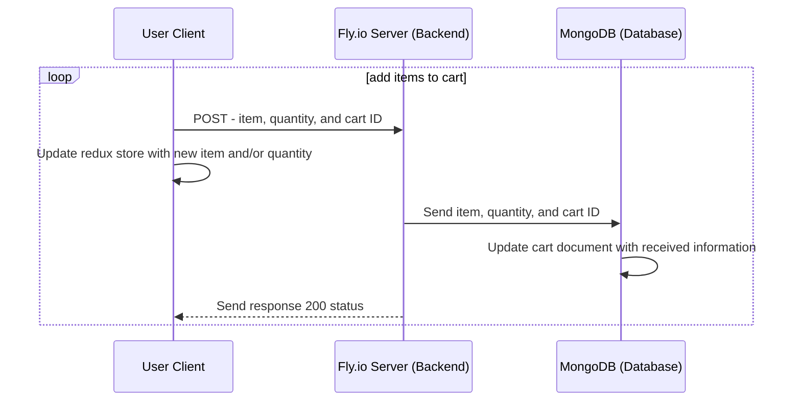

```mermaid
sequenceDiagram
participant c as User Client
participant b as Fly.io Server (Backend)
participant d as MongoDB (Database)

loop add items to cart
c->>b: POST - item, quantity, and cart ID
c->>c: Update redux store with new item and/or quantity
b->>d: Send item, quantity, and cart ID
d->>d: Update cart document with received information
b-->>c: Send response 200 status
end
```