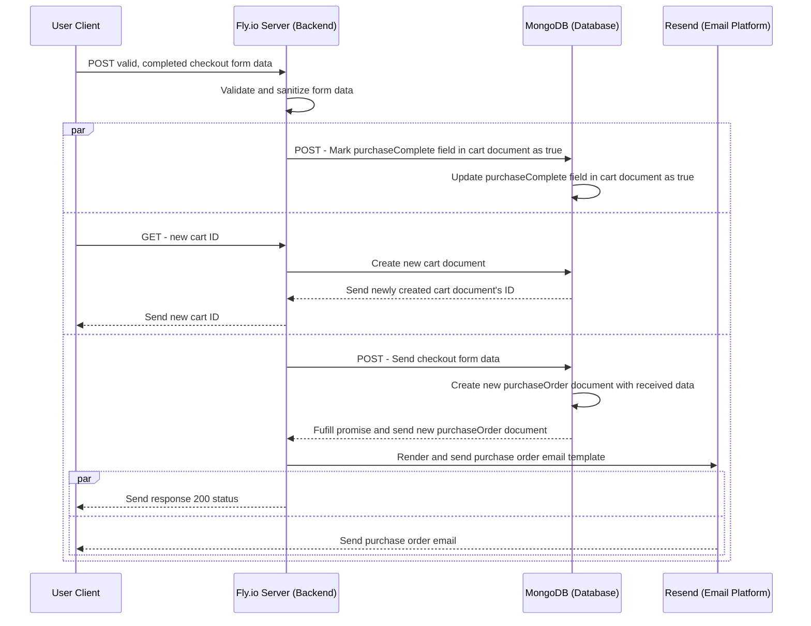

```mermaid
sequenceDiagram
participant c as User Client
participant b as Fly.io Server (Backend)
participant d as MongoDB (Database)
participant r as Resend (Email Platform)

c->>b: POST valid, completed checkout form data
b->>b: Validate and sanitize form data
par
    b->>d: POST - Mark purchaseComplete field in cart document as true 
    d->>d: Update purchaseComplete field in cart document as true
and
    c->>b: GET - new cart ID
    b->>d: Create new cart document
    d-->>b: Send newly created cart document's ID 
    b-->>c: Send new cart ID
and
    b->>d: POST - Send checkout form data
    d->>d: Create new purchaseOrder document with received data
    d-->>b: Fufill promise and send new purchaseOrder document
    b->>r: Render and send purchase order email template
    par 
        b-->>c: Send response 200 status
    and
        r-->>c: Send purchase order email
    end
end
```