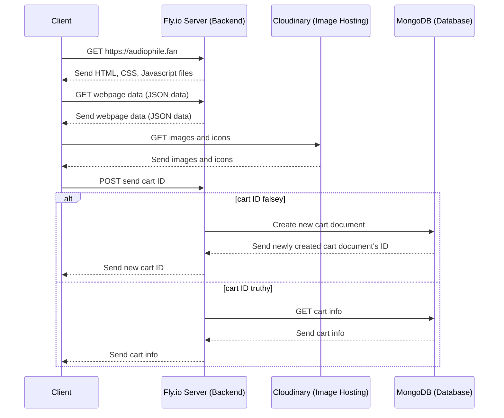

```mermaid
sequenceDiagram
participant c as Client
participant b as Fly.io Server (Backend)
participant cl as Cloudinary (Image Hosting)
participant d as MongoDB (Database)

c->>b: GET https://audiophile.fan
b-->>c: Send HTML, CSS, Javascript files
c->>b: GET webpage data (JSON data)
b-->>c: Send webpage data (JSON data)
c->>cl: GET images and icons
cl-->>c: Send images and icons
c->>b: POST send cart ID
alt cart ID falsey
    b->>d: Create new cart document
    d-->>b: Send newly created cart document's ID 
    b-->>c: Send new cart ID
else cart ID truthy
    b->>d: GET cart info
    d-->>b: Send cart info
    b-->>c: Send cart info
end
```