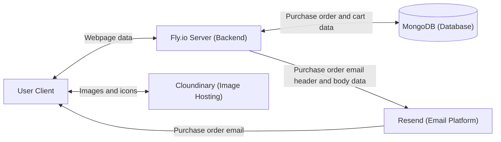

```mermaid
flowchart LR
    A[User Client] <-->|Webpage data| B["Fly.io Server (Backend)"]
    A <--> |Images and icons| E["Cloundinary (Image Hosting)"]
    B <--> |Purchase order and cart data|C[("MongoDB (Database)")]
    B --> |Purchase order email header and body data| D["Resend (Email Platform)"]
    D --> |Purchase order email| A
```